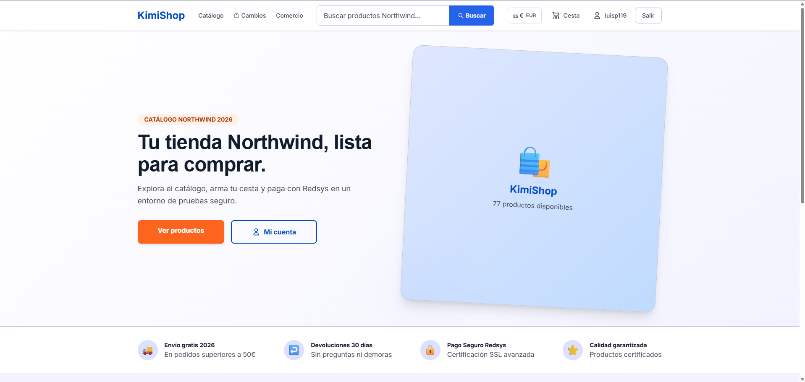
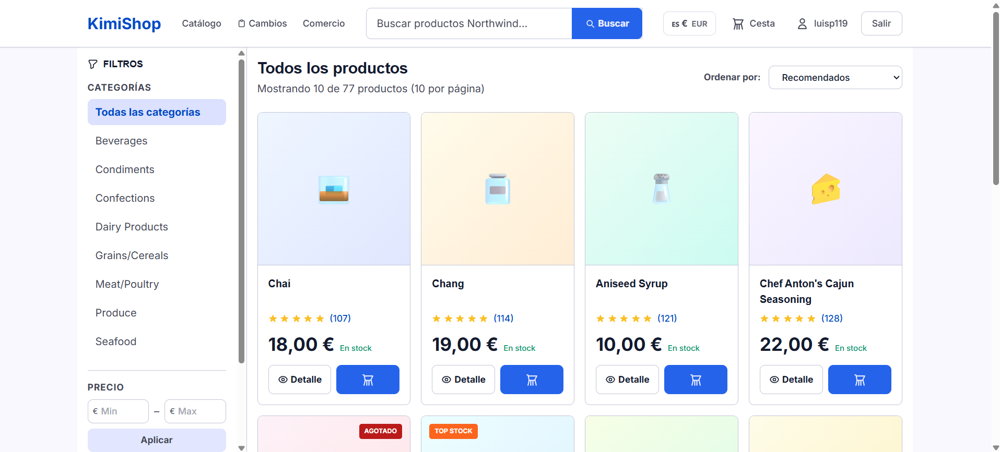
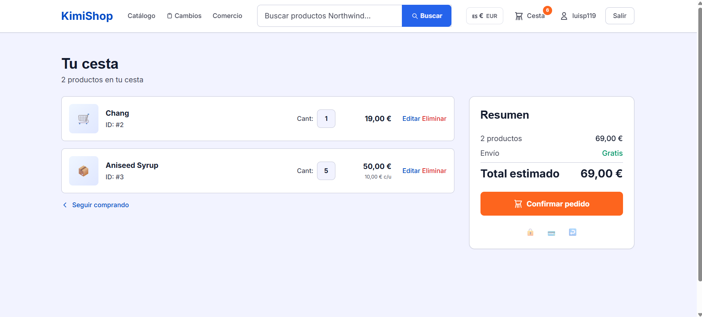
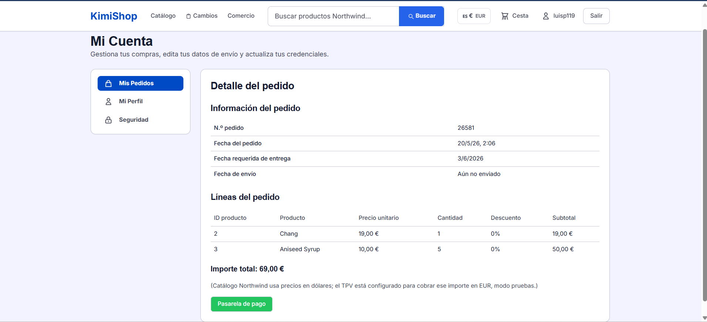
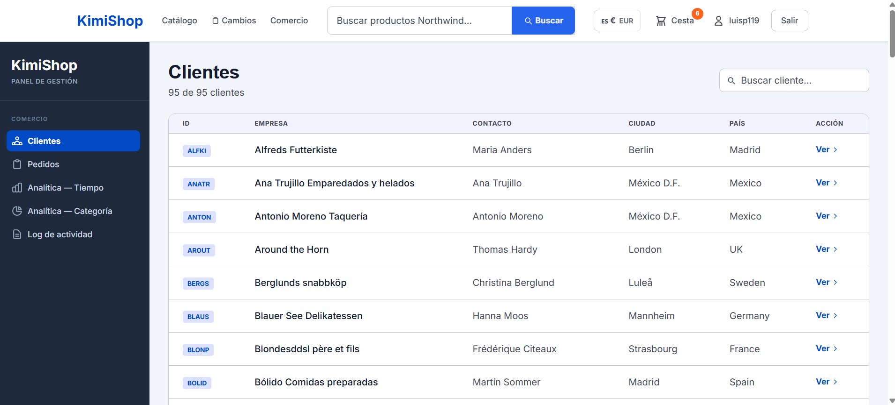
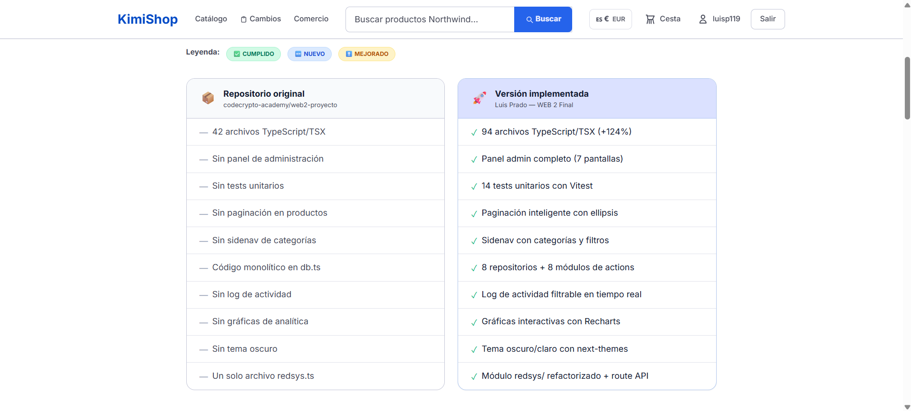
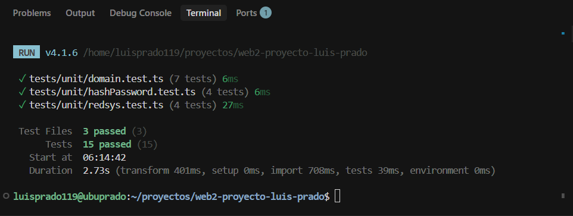

# Proyecto fin de WEB 2



## Documentación

- **[Guía completa del proyecto](GUIA_COMPLETA_PROYECTO.md)** — instalación, cómo revisar funcionalidades, panel de administración, **WSL**, `sqlite3` y comandos útiles.

**Sobre algunas carpetas:** la aplicación principal está en la raíz (`src/`). La carpeta **`repositorio/`** es una **copia de referencia** (snapshot paralelo que también está en este repo). Las carpetas **`src_backup_original/`** y **`src_stitch_design/`** son respaldos de diseño / código anterior. La carpeta **`coverage/`**, si la generas con `npm run test:coverage`, **no se sube a Git**: es resultado local de tests (HTML/JavaScript generado).

## Arranque en local

1. **Clonar** el repositorio e ir a la carpeta del proyecto.
2. **Variables de entorno**: crear `.env.local` desde el ejemplo (**`cp .env.example .env.local`** en Linux/Mac; copia manual en Windows). El archivo `.env.local` **no se sube a Git**. Debe incluir al menos:
   - `JWT_SECRET` — cadena larga y aleatoria para firmar JWT.
   - `NEXT_PUBLIC_REDSYS_SECRET` y `NEXT_PUBLIC_REDSYS_URL` — datos del entorno de pruebas de Redsys (ver documentación del curso / `PLAN_DE_TRABAJO.md`).
   - *Opcional* `NEXT_PUBLIC_APP_ORIGIN` — URL pública **HTTPS** de tu app cuando pruebas el retorno desde Redsys (p. ej. túnel `ngrok`): Redsys navega desde `https://sis-t.redsys.es` hacia esa URL para `/ok/` y `/ko/`. Sin túnel, deja este vacío y usa sólo **http://127.0.0.1:3000** **con `npm run dev` encendido** al hacer clic en «Continuar» en la pantalla de Redsys.
3. **Dependencias**: `npm install`.

**Base de datos:** el proyecto incluye **`northwind.db`** en el repositorio (SQLite Northwind extendida para usuarios, cesta y cobros). Ábrela en IDE o con cliente SQLite si necesitas revisar datos.

4. **Servidor de desarrollo**: `npm run dev` → [http://127.0.0.1:3000](http://127.0.0.1:3000) (el script enlaza `127.0.0.1` para reducir problemas con `localhost` e IPv6).

### Retorno desde Redsys (`/ok/`) muestra sin conexión o error en consola

Tras autorizar el pago, Redsys **redirige** al navegador hacia **`DS_MERCHANT_URLOK`**, construido con tu origen (por defecto el de la tienda, p. ej. `http://127.0.0.1:3000/ok/...`). Si ves **`chrome-error://chromewebdata`** o mensajes tipo *Unsafe attempt to load URL … from frame*:

1. **`npm run dev` debe estar en marcha** en la misma máquina antes de cerrar la ventana emergente/túnel sobre Redsys; si el servidor está parado, la vuelta a localhost fallará.
2. Usa **`127.0.0.1`** de forma estable (el script ya lo fuerza para el dev server); evita alternar entre `localhost` y `127.0.0.1` después de iniciar el pago.
3. Si un antivirus/extension bloquea `http:` desde páginas bancarias, prueba otro navegador o **`NEXT_PUBLIC_APP_ORIGIN`** con un dominio público HTTPS (ngrok/cloudflared) apuntando al puerto 3000.

El formulario hacia Redsys lleva **`target="_top"`** para que todo el viaje sea en la pestaña superior (evita quedarte en un iframe).

**Windows:** si `npm install` falla al compilar `sqlite3`, suele faltar el workload de C++ de Visual Studio Build Tools, o puedes instalar dependencias y ejecutar `npm run dev` desde **WSL** en la misma carpeta (`/mnt/c/...`).

### Errores frecuentes en desarrollo (logs de Next.js)

Si en la consola aparecen mensajes como **`Cannot find module './NNN.js'`**, **`404`** en rutas `/_next/static/chunks/...`, o avisos de **webpack** sobre archivos que faltan bajo `.next/server/vendor-chunks/`, casi siempre la carpeta **`.next` está incompleta o desincronizada** (compilación interrumpida, petición cancelada durante el primer compilar, o mezclar **Windows y WSL** sobre el mismo proyecto generando `node_modules` / `.next` en distintos entornos).

**Qué hacer:**

1. Para el servidor (`Ctrl+C`) y vuelve a arrancar solo **después** de limpiar: `rm -rf .next node_modules/.cache` (en PowerShell: `Remove-Item -Recurse -Force .next, node_modules/.cache -ErrorAction SilentlyContinue`).
2. Evita tener **dos** `npm run dev` abiertos sobre el mismo proyecto.
3. Trabaja siempre desde **un solo entorno** para ese clone (solo WSL *o* solo Windows), con **`npm install`** hecho ahí.
4. En el navegador, haz una **recarga forzada** (p. ej. Ctrl+Shift+R) o prueba en ventana de incógnito para no pedir chunks de un build antiguo.
5. Si desarrollas en **WSL** con el repo en **`/mnt/c/...`**, el disco de Windows vía 9p es lento y el *file watcher* suele fallar; el proyecto activa **polling** de webpack en `next.config.mjs` en modo dev. Lo más fiable es copiar el proyecto al home de Linux (`~/proyectos/...`) y ejecutar ahí `npm install` y `npm run dev`.
6. Si tras limpiar `.next` siguen los 404, prueba **`npm run dev:turbo`** (Turbopack) en lugar de Webpack.

Los mensajes *"The user aborted a request"* durante el primer compilar suelen aparecer si cierras la pestaña o interrumpes la carga; no indican un fallo grave por sí solos.

Los **avisos de preload de fuentes** en el navegador suelen ir ligados a que no cargó el CSS/JS principal; cuando el bundle es coherente desaparecen. En `layout.tsx`, `next/font` exige valores literales en las opciones: las fuentes usan `preload: false` para cumplir el loader y reducir avisos en consola (no se puede usar `process.env` ahí).

**Favicon:** hay un icono estático en `public/favicon.svg` (sin pasar por el bundler), referenciado en metadata, para evitar el error 500 habitual del `favicon.ico` generado cuando `.next` va incompleto.

Los **`console.error` desde `logActivity`** en el servidor indican que falló el `INSERT` en `activity_log` (por ejemplo tabla antigua); confirma que `ensureSchema` se ejecutó sobre `northwind.db` actual.

---

## Objetivos del proyecto
    
1. Desmostrar el uso del front y back
2. Trabajar con Bases de datos relacionales
3. Comprender como funciona la autenticacion.
4. Usar una pasarela de pago 
5. Usar apis y sercicios externos.
6. Cuidar el diseño

## Contexto del proyecto

Se trata de hacer un ecommerce en el que haya dos perfiles bien diferenciados. El cliente y el gestor del comercio.

### Nivel 1. Cliente

Se trata de hacer una web que presente unos productos, permita al usuario seleccionar uno o varios productos y que pueda pagarlos con una pasarela de pago.

### Tecnologia a usar
1. Vamos a usar un framwework que tiene mucha traccion que se llama nextjs. Se trata de un framework que combina front / back en un unico proyecto. 
2. La base de datos que vamos a usar es sql y el modelo es de de Northwind, una base de datos que ya hemos usado en la practicas de sql.
3. Para la pasarela de pago usaremos la pasarela redsys, una pasarela espa;ola de bastante uso.
4. Los datos para el registro de usuario son user y password. 
5. Para los componentes de diseño usaremos shadcn, que usa tailwind por debajo.


## Especificaciones del Proyecto

### 1. Autenticación y Gestión de Usuarios

#### 1.1 Registro y Login
- Implementar sistema de registro (SignUp) y login. En el signup daremos de alta Customers
- Generar JWT al hacer login y almacenarlo en localStorage.
- Validar el token en el servidor en cada uso para verificar integridad y caducidad.

#### 1.2 Seguridad
- Hashear la contraseña antes de enviarla al servidor.
- Implementar cambio de contraseña para usuarios autenticados.

#### 1.3 Gestión de Sesión
- Redirigir al dashboard tras login exitoso.
- Redirigir a login o home si se intenta acceder al dashboard sin autenticación.

#### 1.4 Perfil de Usuario
- Permitir edición del registro de cliente (customer) autenticado.

### 2. Catálogo de Productos



#### 2.1 Listado de Productos
- Desarrollar página que muestre todos los productos disponibles.

#### 2.2 Página de Producto Individual
- Mostrar detalles del producto seleccionado.
- Permitir especificar cantidad deseada.

### 3. Gestión del Carrito de Compras



#### 3.1 Funcionalidad del Carrito
- Agregar productos con cantidades especificadas.
- Mantener carrito para usuarios no autenticados.
- Asociar carrito al usuario tras autenticación.
- Persistir carrito entre sesiones para usuarios autenticados.
- Eliminar carrito si el usuario no se autentica.

#### 3.2 Modificación del Carrito
- Permitir cambios en la cantidad de productos.
- Eliminar productos si la cantidad se establece en 0.

### 4. Proceso de Pedido



#### 4.1 Confirmación del Pedido
- Permitir confirmación del contenido del carrito.
- Crear registros en tablas Orders y Order Details.

#### 4.2 Visualización del Pedido
- Mostrar detalles del pedido confirmado a usuarios autenticados.

### 5. Proceso de Pago

#### 5.1 Integración de Pasarela de Pago (Redsys)
- Implementar pago utilizando Redsys.
- URL de pruebas: https://pagosonline.redsys.es/entornosPruebas.html
- Datos de tarjeta de prueba:
  - Número: 4548810000000003
  - Caducidad: 12/29
  - Código de seguridad: 123

#### 5.2 Registro de Pago
- Crear registro en la tabla `cobro` tras pago exitoso.

#### 5.3 Manejo de Errores de Pago
- Implementar reintentos si el pago falla o es cancelado.

### 6. Configuración y Seguridad

#### 6.1 Gestión de Variables de Entorno
- Almacenar claves de servicios en archivo .env.
- Excluir .env de control de versiones (no subir a GitHub).

## Estructura de la Base de Datos (SQLite)

Tablas añadidas a la base de datos.

Archivo: `northwind.db`

### Tablas

#### 1. users
```sql
CREATE TABLE IF NOT EXISTS users (
    id INTEGER PRIMARY KEY AUTOINCREMENT,
    username TEXT UNIQUE NOT NULL,
    password TEXT NOT NULL,
    acceptPolicy BOOLEAN NOT NULL,
    acceptMarketing BOOLEAN NOT NULL
);
```
Notas:
- Se inicializa con todos los customers.
- Utilizada para autenticación.

**Nota (implementación actual):** la tabla `users` incorpora además la columna `role` (`TEXT NOT NULL DEFAULT 'customer'`). El JWT del login incluye el rol; solo `admin` puede usar las rutas bajo `/admin`. El DDL detallado está en `src/lib/db/schema.ts`.

#### 2. cesta
```sql
 CREATE TABLE IF NOT EXISTS cesta (
                id INTEGER PRIMARY KEY AUTOINCREMENT,
                productId INTEGER NOT NULL,
                cestaId TEXT NOT NULL,
                username TEXT NULL,
                cantidad INTEGER NOT NULL,
                UNIQUE(productId, cestaId)
            )
```

#### 3. cobro
```sql
CREATE TABLE IF NOT EXISTS cobro (
    id INTEGER PRIMARY KEY AUTOINCREMENT,
    orderId INTEGER NOT NULL,
    customerId TEXT NOT NULL,
    amount REAL NOT NULL,
    authorizationCode TEXT NOT NULL UNIQUE,
    fecha TEXT NOT NULL
);
```

#### 4. activity_log

Registro de auditoría (login, alta, pedidos, pagos, cambio de contraseña, envíos, etc.). DDL completo en `src/lib/db/schema.ts`.

```sql
CREATE TABLE IF NOT EXISTS activity_log (
    id INTEGER PRIMARY KEY AUTOINCREMENT,
    username TEXT NOT NULL,
    action TEXT NOT NULL,
    target TEXT NULL,
    fecha TEXT NOT NULL
);
```

---

## Panel de gestión comercio (`/admin`)



Área **Nivel 2 — perfil comercio** implementada con Next.js (App Router), JWT con `role`, y gráficos con **Recharts**.

### Acceso y permisos

- Solo usuarios con **`role = 'admin'`** en la tabla `users` pueden entrar; el servidor valida el token con `requireAdmin` en las *server actions* de `src/lib/db/db.ts`.
- Tras cambiar el rol en base de datos, el usuario debe **cerrar sesión y volver a iniciar sesión** para que el JWT emitido en el login traiga `role: admin` (tokens antiguos pueden seguir reflejando solo `customer` en el payload).

### Promover un usuario a administrador

En la raíz del proyecto (misma carpeta que `northwind.db`):

```bash
npm run seed-admin <username>
```

Donde `<username>` es un usuario ya existente en `users` (coincide con el `CustomerID` tras el registro). El script actualiza la fila en SQLite.

### Rutas y funcionalidad

| Ruta | Descripción |
|------|-------------|
| `/admin` | Redirección a `/admin/clientes`. |
| `/admin/clientes` | Listado de clientes (`Customers`). |
| `/admin/clientes/[customerId]` | Pedidos de un cliente. |
| `/admin/pedidos` | Últimas compras (órdenes recientes). |
| `/admin/pedidos/[orderId]` | Detalle del pedido; marcar como enviado (`ShippedDate`). |
| `/admin/analitica/tiempo` | Ventas agregadas por granularidad (día, mes, trimestre, semestre, año). |
| `/admin/analitica/categoria` | Ventas por categoría y tiempo (misma granularidad). |
| `/admin/log` | Log de actividad con filtros opcionales por usuario y acción. |

En la cabecera, si la sesión es admin, aparece el enlace **Comercio** hacia `/admin`. El layout admin usa `ProtectedAdminRoute` (`src/components/app/ProtectedAdminRoute.tsx`): sin sesión se redirige a login; con sesión pero sin rol admin, a la home.

---

### Nivel 2. Mejoras en el cliente


1. En la pagina de productos poner un sidenav con las categorias. Pinchando que aparezcan los productos
2. Pagina los productos de 10 en 10


#### Perfil comercio

La implementación en este repositorio (rutas, permisos, script `seed-admin`, tablas `role` y `activity_log`) está documentada en la sección **Panel de gestión comercio (`/admin`)** más arriba.

Claro, aquí tienes el texto reformateado:

---

Se trata de solucionar la parte del comercio. Habrá usuarios registrados a los que el administrador del sistema les otorgará permisos de gestor del eCommerce.

Los usuarios con permisos de gestor podrán:

1. Ver la lista de clientes.
2. Ver la lista de las últimas compras.
3. Consultar las compras realizadas por cada cliente.
4. Cambiar el estado de un pedido a "enviado".
5. Analizar las ventas usando el tiempo como variable (día/mes/hora/trimestre/semestre/año).
6. Analizar las ventas usando la categoría y el tiempo.
7. Consultar el log de actividad del usuario. 

--- 

Espero que esto sea lo que necesitabas.
### Nivel 3. Refactoring 



1. Usar la orientacion a objetos para mejorar el codigo.
2. Usar test para realizar algunos test.


